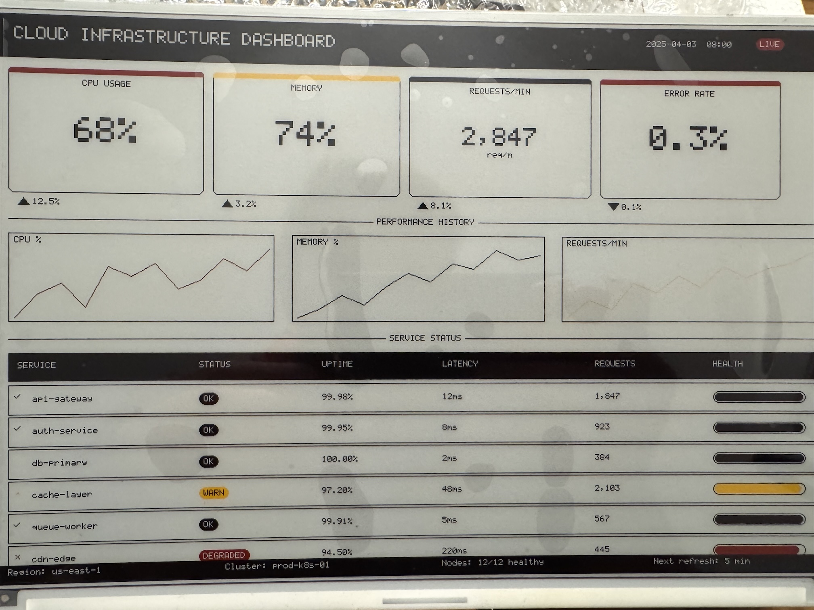

# GDEM102F91 Arduino Library

An Arduino library for the **Good Display GDEM102F91** — a 10.2-inch, 960×640, four-color (black, white, red, yellow) e-paper display — running on the **Waveshare ESP32 Driver Board Rev 3**.

This library was reverse-engineered from the panel's official datasheet after discovering that no existing Arduino library supported the GDEM102F91's SSD2677 controller and 4-color waveform. It solves the ESP32 memory limitation with a tile-based renderer that uses only ~5KB of RAM regardless of display size.



---

## Features

- **Full drawing API** — pixels, lines, rectangles, rounded rects, circles, triangles (filled and outlined)
- **Text rendering** — built-in 6×8 bitmap font, scalable 1×–4× (6×8 up to 24×32 px)
- **10 built-in icons** — check, cross, warning, info, arrows, cloud, server, chart, lock
- **Dashboard widgets** — metric cards, progress bars, sparkline charts, status badges, dividers, trend indicators
- **Bitmap rendering** — 2bpp (4-color) and 1bpp (monochrome, with optional transparency) bitmaps from `PROGMEM`
- **Conversion scripts** — Python and Go scripts to convert PNG images to `PROGMEM` arrays
- **Tile renderer** — renders 20 rows at a time, keeping peak RAM usage under 5KB
- **4-color support** — black, white, red, and yellow on a single panel

---

## Hardware

| Component | Details |
|-----------|---------|
| Display | Good Display GDEM102F91 |
| Size | 10.2 inch |
| Resolution | 960 × 640 px |
| Colors | Black, White, Red, Yellow |
| Controller IC | SSD2677 |
| Interface | 4-wire SPI (FPC7705 REV.b, 24-pin 0.5mm) |
| Driver board | Waveshare ESP32 Driver Board Rev 3 |

### Wiring

| Signal | ESP32 GPIO |
|--------|-----------|
| BUSY   | 25 |
| CS     | 15 |
| RST    | 26 |
| DC     | 27 |
| SCK    | 13 |
| MISO   | 12 |
| MOSI   | 14 |

Connect the display's FPC ribbon directly to the driver board's FPC connector with the gold contacts facing up. Set the driver board's DIP switches to **A / ON**.

---

## Installation

1. Download the latest `GDEM102F91.zip` from [Releases](../../releases)
2. In Arduino IDE: **Sketch → Include Library → Add .ZIP Library**
3. Select the downloaded zip

To update: delete the `GDEM102F91` folder from your `Arduino/libraries/` directory and repeat.

> **Board settings:** Tools → Board → ESP32 Arduino → `ESP32 Dev Module`

---

## Quick Start

```cpp
#include <GDEM102F91.h>

//                       CS  DC  RST BSY SCK  MISO MOSI
GDEM102F91 display(      15, 27, 26, 25, 13,  12,  14);

// Your scene function — called once per tile (32 times per refresh)
void myScene(void* epd) {
    GDEM102F91* d = (GDEM102F91*)epd;

    // Header bar
    d->fillRect(0, 0, 960, 48, EPD_BLACK);
    d->drawString(16, 14, "MY DASHBOARD", EPD_WHITE, 2);

    // Metric card
    d->drawMetricCard(10, 60, 215, 140,
        "CPU USAGE", "68%", "",
        EPD_WHITE, EPD_BLACK, EPD_RED);

    // Progress bar
    d->drawProgressBar(10, 220, 400, 16,
        68.0f, EPD_BLACK, EPD_WHITE, EPD_BLACK);
}

void setup() {
    display.begin();
    display.render(myScene, EPD_WHITE);  // ~20 seconds
    display.sleep();
}

void loop() {
    delay(300000);  // 5 minutes
    display.render(myScene, EPD_WHITE);
    display.sleep();
}
```

---

## How the Tile Renderer Works

The full display framebuffer is 153,600 bytes (960×640 at 2 bits/pixel) — too large for the ESP32's ~320KB DRAM. Instead of a full framebuffer, the library renders in **horizontal tiles of 20 rows** (~4,800 bytes each).

During `render()`, the library:
1. Clears the tile buffer to the background color
2. Calls your scene callback with a pointer to the display
3. Flushes the tile to the display over SPI
4. Advances to the next tile and repeats (32 tiles total)

All drawing calls **automatically clip to the active tile** — your scene function is written exactly as if you had a full framebuffer. The tile machinery is invisible to your code.

---

## Color Reference

| Constant | Pixel Value | Byte Pattern | Description |
|----------|-------------|--------------|-------------|
| `EPD_BLACK`  | `PIXEL_BLACK`  (0) | `0x00` | Black |
| `EPD_WHITE`  | `PIXEL_WHITE`  (1) | `0x55` | White |
| `EPD_YELLOW` | `PIXEL_YELLOW` (2) | `0xAA` | Yellow |
| `EPD_RED`    | `PIXEL_RED`    (3) | `0xFF` | Red |

Use `EPD_*` constants with fill/draw calls. Use `PIXEL_*` constants with `setPixel()`.

---

## API Reference

### Lifecycle

```cpp
display.begin();                          // Initialise SPI and controller
display.render(sceneCallback, EPD_WHITE); // Render full display (~20s)
display.sleep();                          // Deep sleep (~0.001mW)
display.wake();                           // Wake from sleep
```

### Primitives

```cpp
d->setPixel(x, y, PIXEL_BLACK);
d->drawLine(x0, y0, x1, y1, EPD_BLACK);
d->drawHLine(x, y, w, EPD_BLACK);
d->drawVLine(x, y, h, EPD_BLACK);
d->drawRect(x, y, w, h, EPD_BLACK);
d->fillRect(x, y, w, h, EPD_WHITE);
d->drawRoundRect(x, y, w, h, r, EPD_BLACK);
d->fillRoundRect(x, y, w, h, r, EPD_YELLOW);
d->drawCircle(cx, cy, r, EPD_RED);
d->fillCircle(cx, cy, r, EPD_RED);
d->drawTriangle(x0, y0, x1, y1, x2, y2, EPD_BLACK);
d->fillTriangle(x0, y0, x1, y1, x2, y2, EPD_BLACK);
```

### Text

```cpp
d->drawChar(x, y, 'A', EPD_BLACK, 2);
d->drawString(x, y, "Hello", EPD_BLACK, 2);
d->drawStringCentered(x, y, width, "Centered", EPD_BLACK, 2);
d->drawInt(x, y, 42, EPD_BLACK, 3);
d->drawFloat(x, y, 3.14f, 2, EPD_BLACK, 2);

int16_t w = d->getStringWidth("Hello", 2);  // returns pixel width
int16_t h = d->getCharHeight(2);             // returns pixel height
```

**Font sizes:**

| Size | Pixels | Use |
|------|--------|-----|
| 1 | 6×8 | Labels, table data, captions |
| 2 | 12×16 | Section headers, badges |
| 3 | 18×24 | Metric values |
| 4 | 24×32 | Hero numbers |

### Bitmaps

Bitmaps are stored in flash (`PROGMEM`) and rendered tile-correctly with no extra RAM overhead. Use the [conversion scripts](#bitmap-conversion-scripts) to generate the header files from PNG images.

```cpp
// 2bpp — 4-color bitmap (black/white/yellow/red), width must be a multiple of 4
d->drawBitmap2bpp(x, y, w, h, myBitmap);

// 1bpp — monochrome bitmap, fgColor drawn for set bits
d->drawBitmap1bpp(x, y, w, h, myIcon, PIXEL_BLACK);           // white background
d->drawBitmap1bpp(x, y, w, h, myIcon, PIXEL_BLACK, 0xFF);     // transparent background (default)
d->drawBitmap1bpp(x, y, w, h, myIcon, PIXEL_RED, PIXEL_WHITE); // red on white
```

**Bitmap format — 2bpp:**
Each byte holds 4 pixels packed MSB-first as `[P0 P0 | P1 P1 | P2 P2 | P3 P3]`, using the same 2-bit color encoding as the display (`00`=black, `01`=white, `10`=yellow, `11`=red). Width must be a multiple of 4.

**Bitmap format — 1bpp:**
Each row is `ceil(w / 8)` bytes. The MSB of each byte is the leftmost pixel. Set bits = foreground, clear bits = background (or transparent if `bgColor` is omitted).

**Example — using a generated bitmap:**
```cpp
#include "logo_2bpp.h"   // generated by bitmap_convert

void myScene(void* epd) {
    GDEM102F91* d = (GDEM102F91*)epd;
    d->drawBitmap2bpp(16, 60, 128, 64, logo);
    d->drawBitmap1bpp(160, 60, 32, 32, iconCheck, PIXEL_BLACK);
}
```

---

### Icons

```cpp
d->drawIcon(x, y, ICON_CHECK,      size, EPD_BLACK);
d->drawIcon(x, y, ICON_CROSS,      size, EPD_RED);
d->drawIcon(x, y, ICON_WARNING,    size, EPD_YELLOW);
d->drawIcon(x, y, ICON_INFO,       size, EPD_BLACK);
d->drawIcon(x, y, ICON_ARROW_UP,   size, EPD_BLACK);
d->drawIcon(x, y, ICON_ARROW_DOWN, size, EPD_RED);
d->drawIcon(x, y, ICON_CLOUD,      size, EPD_BLACK);
d->drawIcon(x, y, ICON_SERVER,     size, EPD_BLACK);
d->drawIcon(x, y, ICON_CHART,      size, EPD_BLACK);
d->drawIcon(x, y, ICON_LOCK,       size, EPD_BLACK);
```

Icons are drawn programmatically. `size` scales the icon: `1` = 8×8px, `2` = 16×16px, etc.

### Dashboard Widgets

```cpp
// Progress bar
d->drawProgressBar(x, y, w, h, percent, fg, bg, border);

// Sparkline chart (auto-scales to fit bounding box)
float values[] = { 42, 55, 61, 48, 70 };
d->drawSparkline(x, y, w, h, values, 5, EPD_RED);

// Metric card with accent bar, label, and large value
d->drawMetricCard(x, y, w, h, "CPU", "68%", "", EPD_WHITE, EPD_BLACK, EPD_RED);

// Status badge (auto-sized pill)
d->drawBadge(x, y, "OK",       EPD_BLACK,  EPD_WHITE);
d->drawBadge(x, y, "WARN",     EPD_YELLOW, EPD_BLACK);
d->drawBadge(x, y, "DEGRADED", EPD_RED,    EPD_WHITE);

// Section divider with optional label
d->drawDivider(x, y, w, EPD_BLACK, "SECTION TITLE", EPD_BLACK);

// Trend arrow + percentage
d->drawTrend(x, y, 12.5f, true,  EPD_BLACK);  // ▲ 12.5%
d->drawTrend(x, y,  3.2f, false, EPD_RED);    // ▼ 3.2%
```

---

## Bitmap Conversion Scripts

The `scripts/` directory contains tools to convert PNG images to `PROGMEM` byte arrays ready to `#include` in your sketch. Both scripts produce identical output and support the same options.

### Python (`scripts/bitmap_convert.py`)

**Requirements:** `pip install Pillow`

```bash
# 4-color (2bpp) — best for full-color logos/images
python3 scripts/bitmap_convert.py --mode 2bpp logo.png

# Monochrome (1bpp) — best for icons and line art
python3 scripts/bitmap_convert.py --mode 1bpp icon.png

# With options
python3 scripts/bitmap_convert.py \
    --mode 2bpp \
    --resize 128x64 \
    --name myLogo \
    --output src/myLogo.h \
    logo.png
```

### Go (`scripts/bitmap_convert.go`)

**Requirements:** Go 1.18+ — no external packages.

```bash
go run scripts/bitmap_convert.go -mode 2bpp logo.png
go run scripts/bitmap_convert.go -mode 1bpp -threshold 128 icon.png

# With options
go run scripts/bitmap_convert.go \
    -mode 2bpp \
    -resize 128x64 \
    -name myLogo \
    -output src/myLogo.h \
    logo.png
```

### Options

| Flag | Default | Description |
|------|---------|-------------|
| `--mode` / `-mode` | `2bpp` | Output format: `2bpp` or `1bpp` |
| `--name` / `-name` | filename stem | C variable name in the generated array |
| `--output` / `-output` | `<stem>_<mode>.h` | Output `.h` file path |
| `--resize` / `-resize` | — | Resize before converting, e.g. `128x64` |
| `--threshold` / `-threshold` | `128` | Luminance cutoff for 1bpp (0–255, lower = more black) |

### Palette mapping (2bpp)

Each pixel is mapped to the nearest of the four display colors by Euclidean RGB distance:

| Color | RGB |
|-------|-----|
| Black | (0, 0, 0) |
| White | (255, 255, 255) |
| Yellow | (255, 215, 0) |
| Red | (255, 0, 0) |

Transparent pixels (alpha < 128) are treated as white in 2bpp mode and as background in 1bpp mode.

### Generated output

The scripts write a `.h` file containing a single `static const uint8_t name[] PROGMEM` array with a usage comment at the top:

```cpp
// logo — 128×64 px, 2bpp, 32 bytes/row, 2048 bytes total
// Usage: display.drawBitmap2bpp(x, y, 128, 64, logo);

static const uint8_t logo[] PROGMEM = {
  0x55, 0x55, 0xAA, 0xFF, ...
};
```

---

## Dashboard Layout Guide

The display is **960×640px** in landscape orientation. A typical dashboard layout:

```
Y:   0 –  48   Header bar (fillRect black, drawString white)
Y:  60 – 200   Metric cards (4 × drawMetricCard, 215px wide, 25px gap)
Y: 200 – 225   Trend indicators (drawTrend below each card)
Y: 225 – 245   Section divider (drawDivider)
Y: 245 – 360   Sparkline charts (3 charts across)
Y: 360 – 380   Section divider
Y: 380 – 615   Status table (6 rows × 36px)
Y: 618 – 640   Footer bar
```

**4 equal-width cards across 960px:**
```cpp
int16_t cardW = 215, cardH = 140;
for (int i = 0; i < 4; i++) {
    int16_t x = 10 + i * 225;
    d->drawMetricCard(x, 60, cardW, cardH,
        labels[i], values[i], "",
        EPD_WHITE, EPD_BLACK, accents[i]);
}
```

---

## Background & Discovery

This library was developed through hardware reverse engineering. The display was purchased as an "SSD1677, 960×640, BWRY" panel, but the initialization sequences for the GDEM102T91 (the closest documented panel) all produced busy timeouts.

Key findings from the process:

- The actual controller is **SSD2677**, not SSD1677 — identified from the GDEM102F91 datasheet once the correct model number was determined from the FPC cable marking (`FPC-7705 REV.b`)
- The **color encoding** was determined empirically: `0x00` = black, `0x55` = white, `0xAA` = yellow, `0xFF` = red
- The **BUSY pin** is active-low on this panel (LOW = busy, HIGH = ready), confirmed by GPIO scanning during initialization
- The **initialization sequence** came directly from section 10.2 of the GDEM102F91 datasheet once correctly identified

---

## Troubleshooting

**Display shows nothing / busy timeout**
Check that the FPC ribbon is fully seated (gold contacts facing up) and the DIP switches are set to A/ON.

**Partial screen update**
The TRES command must encode exactly 960×640. Verify bytes `0x03, 0xC0, 0x02, 0x80` in `_init()`.

**Wrong colors**
Color encoding is panel-specific and confirmed empirically. Do not assume it matches other SSD2677 panels.

**Upload fails with "Connecting..."**
Hold the BOOT button on the ESP32 board when the IDE shows `Connecting...`. Release once upload starts.

**DRAM overflow at compile time**
You have likely declared a large buffer globally. All drawing must happen inside the `render()` scene callback — the library manages the tile buffer internally.

---

## Known Limitations

- No partial refresh support (full screen only, ~20 seconds)
- Font is bitmap only — no vector or variable-width fonts
- Bitmap scaling not supported — images render at 1:1 pixel resolution (use `--resize` in the conversion scripts)
- Designed and tested only on Waveshare ESP32 Driver Board Rev 3

---

## Display Specifications

| Parameter | Value |
|-----------|-------|
| Model | GDEM102F91 |
| Manufacturer | Dalian Good Display Co., Ltd. |
| Screen size | 10.2 inch |
| Resolution | 960 × 640 px |
| Colors | Black, White, Red, Yellow |
| Controller | SSD2677 |
| Interface | 4-wire SPI |
| FPC | 24-pin, 0.5mm pitch |
| Active area | 215.52 × 143.68 mm |
| Refresh time | ~20 seconds |
| Power (refresh) | 66mW typical |
| Power (sleep) | 0.0012mW |
| Operating temp | 0 to +40°C |
| Supply voltage | 2.3 – 3.6V |

---

## License

MIT
